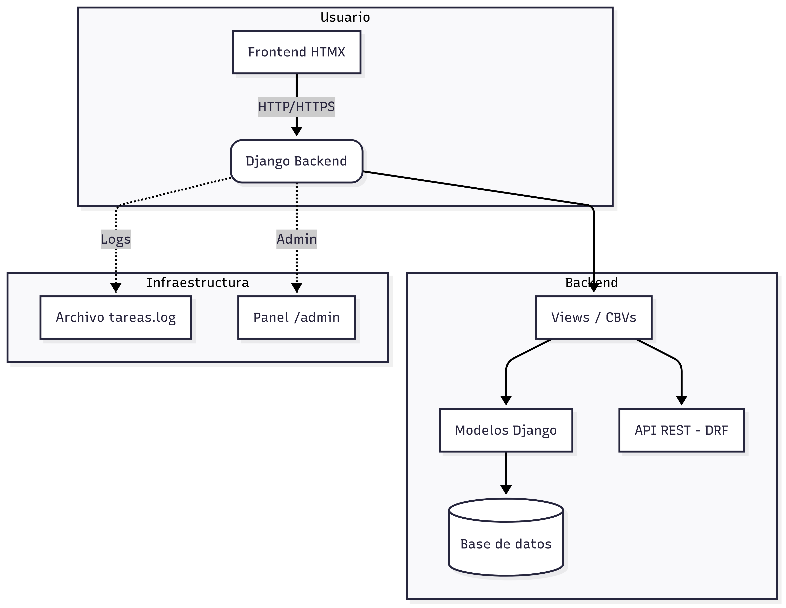

# Todolist
Todolist es una aplicación de gestión de tareas desarrollada con **Django** y **Django REST Framework**, que incluye autenticación de usuarios, API REST, panel de administración y frontend interactivo mediante **HTMX**.  
La aplicación está diseñada para ejecutarse en contenedores usando **Docker Compose**, lo que facilita la configuración y despliegue en entornos locales y de producción.

---

## Clonación del repositorio
Clonar el repositorio en el entorno local:

```bash
git clone <https://github.com/Anibal-Reinoso/todo-challenge>
cd task_manager
```

###  Asignar permisos al script de setup
El proyecto incluye un script .setup.sh para crear un entorno virtual con Python 3 e instalar dependencias.
Primero, otorgue permisos de ejecución:
```bash
chmod +x .setup.sh
```
### Ejecutar el script de setup
Este comando configurará el entorno virtual y cargará las dependencias de requirements.txt:
```bash
./.setup.sh
```
### Ejecución con Docker Compose
Levantar la aplicación con:
```bash
docker compose up
```
# Credenciales por defecto
### Usuario administrador:
```bash
Usuario: usuario1
Contraseña: password123
```

# Endpoints principales
Frontend: http://localhost:8000

API REST: http://localhost:8000/api

Panel de administración: http://localhost:8000/admin

# Arquitectura del sistema

